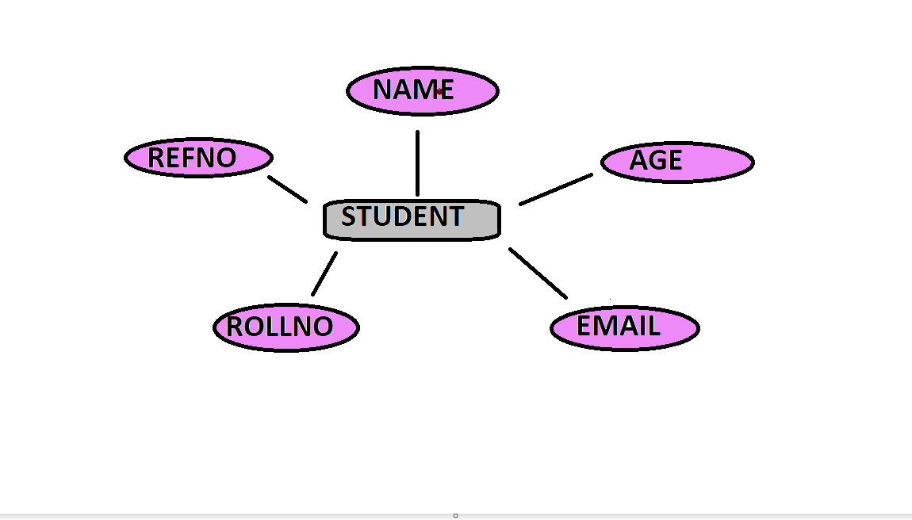
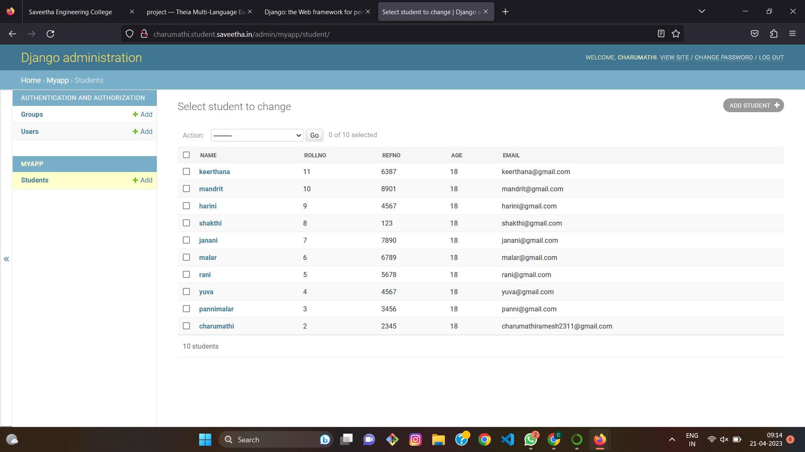

# Ex02 Django ORM Web Application

## AIM
To develop a Django application to store and retrieve data from a student database using Object Relational Mapping(ORM).

## Entity Relationship Diagram



## DESIGN STEPS

### STEP 1:
clone the respository from github

### STEP 2:
create on admin interface for django

### STEP 3:
create an folder and edit settings.py

### STEP 4:
makemigration and migrate the changes

### STEP 5:
create admin.py and write program for admin and models


## PROGRAM
```
admin.py
from django.contrib import admin
from .models import student,studentAdmin
admin.site.register(student,studentAdmin)

models.py
from django.db import models
from django.contrib import admin
class student (models.Model):
    name=models.CharField(max_length=20,help_text="student")
    rollno=models.IntegerField()
    refno=models.IntegerField()
    age=models.IntegerField()
    email=models.EmailField()
class studentAdmin(admin.ModelAdmin):
    list_display=('name','rollno','refno','age','email')
```

## OUTPUT



## RESULT
The program  for creating student database using ORM is successful
